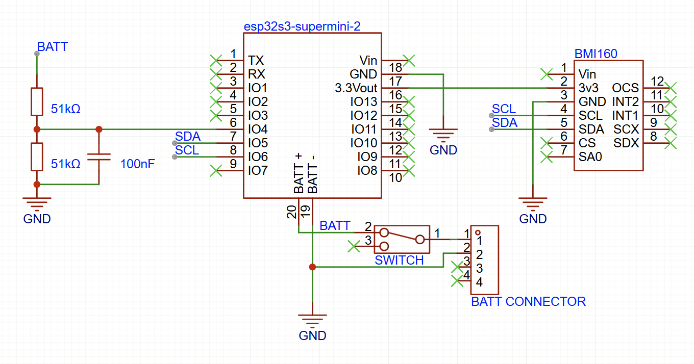
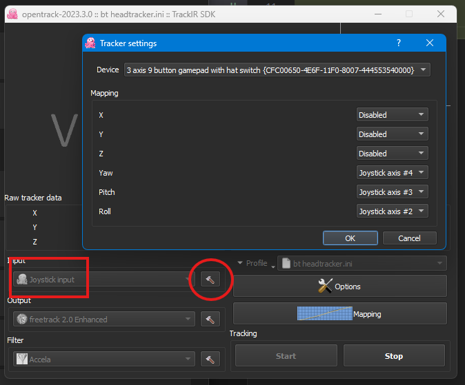

# ESP32 3-DoF Bluetooth Headtracker

- emulates a gamepad to work with OpenTrack.
- strap it to your forehead with a head band :-)
- device must be strapped in the correct orientation, can be checked via the serial console. 
- ./docs folder has various prototype pics, schematics, opentrack setup, etc.

## features

- esp32-s3 supermini (builtin battery charging circuit)
- bmi160 imu (gyro and accel)
- simple battery voltage measurement circuit, reports battery level over bluetooth.
- emulates gamepad X (roll), Y (pitch) and Z (Yaw) axes.
- simple serial console to perform basic operations (including gyro calibration).
- stores gyro calibation offsets in eeprom.

## serial console

connect via USB to perform basic operations, type one of the following commands and press ENTER over the serial console.

- `restart`: restart device
- `batt`: show battery level
- `imu`: show imu output (gyro, accel and pitch/roll/yaw). used to check proper orientation of device when the pitch and roll angles are close to zero.
- `config`: show configuration (currently includes only gyro calibration offsets)
- `clear`: clear configuration (currently zeros out gyro calibration offsets)
- `calibrate`: start gyro calibration (need to keep device still)

## LED indication

- solid white: booting up.
- flashing red: error during bootup.
- flashing blue: updating IMU status over bluetooth.
- flashing green: calibrating the gyro.
- nothing: probably waiting for bluetooth connection.

## pictures

> external view. box is about 40mm x 35mm x 19mm.  

> internal view.  

> front side of protoype pcb showing esp32-s3 supermini and battery switch.  

> back side of protoype pcb showing bmi160, voltage divider and battery wires.  

> schematic diagram. esp32 connected to bmi160, simple voltage divider, battery switch and battery connector.  

> windows bluetooth setup showing the device being detected and battery level. last 4 hex digits in the device name is the part of the mac address.  

> windows usb game controller setup showing the gamepad controller.  

> opentrack setup. change the input source to "Joystick Input". set the Yaw, Pitch and Roll mapping to the appopriate joystick axis.  

